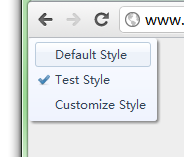

## MyWeb

MyWeb is a tool for customizing style/layout of web sites (any sites you are browsing), sharing results with others and consuming styles/layouts created by others.

[Download](https://github.com/WenchaoZeng/MyWeb/wiki/Releases)

## Why we need this tool

Before this, users browse web sites normally in one fixed style and layout and could not change it in accordance with their preferences. For example, if the font of a site is too small for users to read, end users can't do anything except accepting it. In general, a web site always has only one layout and style, while some users may want other ones which are consistent with their habits, such as black background, green text, bigger text, fit to small screen etc..

I, as a web developer, know that I can change the layout/style of a site if I can edit its [CSS](http://en.wikipedia.org/wiki/Cascading_Style_Sheets) or append my own CSS content to it. By customizing CSS, we suddenly realize that we have our own control for sites we are browsing. We no longer only accept the only one style/layout that the site provides, we can design our own style to fit our special needs.

Another important thing is that, not all users are web developers or designers who have [HTML](http://en.wikipedia.org/wiki/HTML), CSS skill to modify the page. If there is a platform that specialists define their own styles and share the results, others are possible to just use these custom styles without any knowledge of HTML, CSS.

So, MyWeb is the tool we need. Web developers and designers use it to customize web site style/layout for their needs and also glad enough to share them with others. Others, end users, have the choices of styles when browse a site.

## For end users

When browse a web site, in the left top corner of the page, users can see a list of styles. By clicking a style in the list, the page style/layout will be changed. The choices are saved and the chosen style is applied when the same site is visited next time. 

## For web designers

If a web developer or designer finds that the style/layout of a site is not good enough, he/she can use our tool to define a custom style for that site, upload to the server by giving his/her email, the style name, and the CSS content. After this, he/she, as an end user, can use the defined styles.

## How it works

Firstly we need a server for sharing styles. Secondly we build a tool (currently it's an extension of chrome browser) for submitting styles and consuming styles.